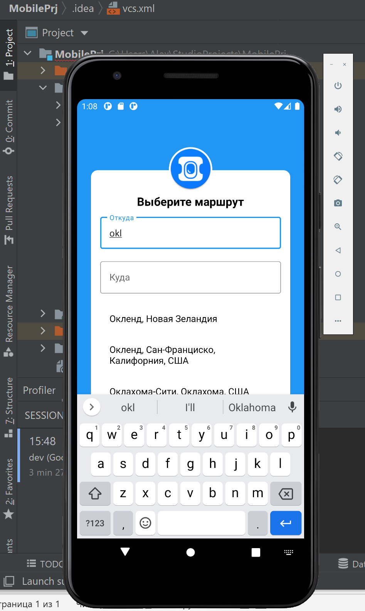
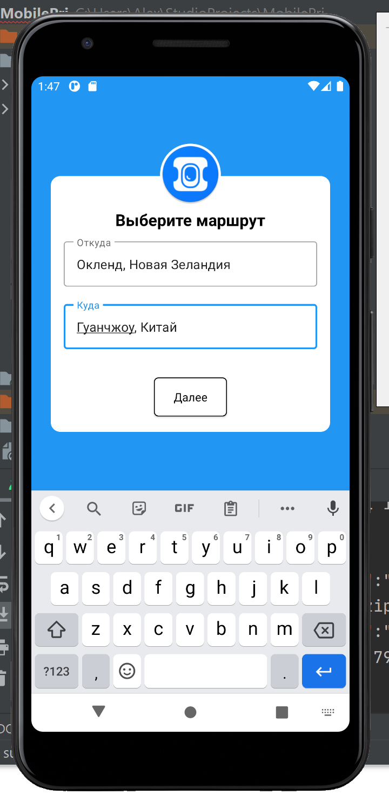
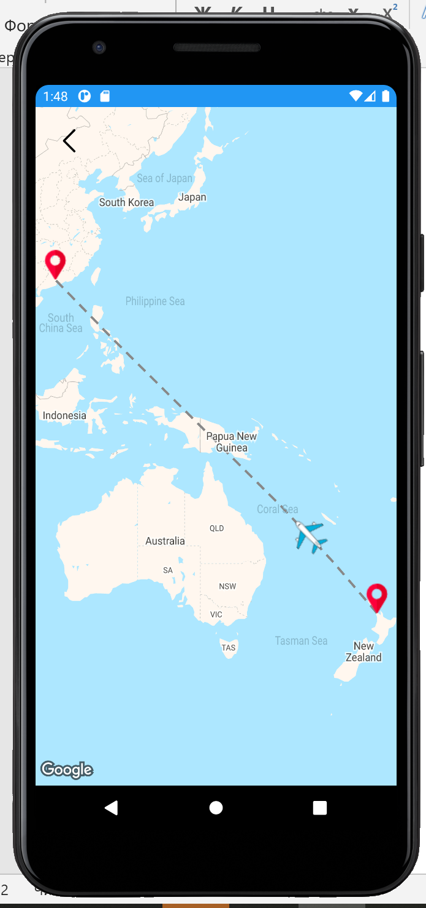

 
# Предисловие
Данное приложение сделано для зачета по Разработке мобильных приложений.
В нем продемонстрирована работа с сетью и картами а также есть простейшая модель, которая наносит на карту две точки и перемешает иконку самолета между ними. В своей работе я вдохновился заставкой Авиасейлс. Авиасейлс не баньте меня))
# Описание
На заглавном экране указываем два города между которыми хотим отправить наш виртуальный самолет. Начинаем вводить текст, и выбираем город из выпадающего списка. Список достается с сайта по подбору отелей, потому что он возвращает еще и координаты найденных городов.

 
 
  
  
После выбора 2 точек нажимаем далее и смотрим анимацию перелета между этими городами:

  
